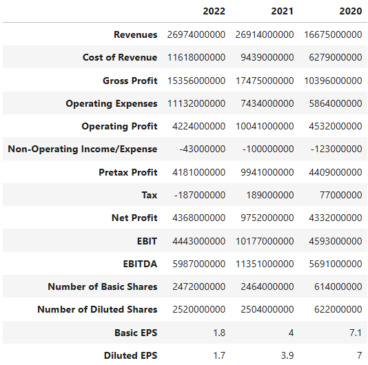
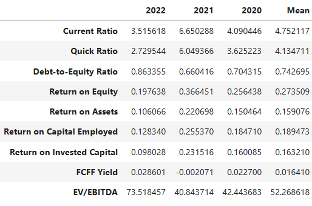
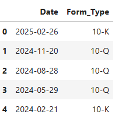
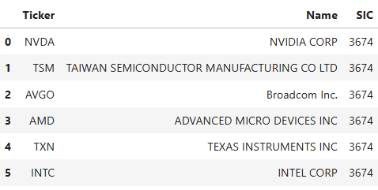

# finqual

This is a work in progress package that enables users to conduct fundamental financial research, utilising the SEC's data and REST API.

## Features

finqual has the following features:
 
- Ability to call the income statement, balance sheet or cash flow statement for any company on SEC's Electronic Data Gathering, Analysis, and Retrieval (EDGAR) system.
- Retrieve comparables companies for a chosen ticker on varying industry classifications (e.g. more general industry classifications or more detailed classifications)
- Breakdown of chosen financial ratios for a chosen ticker
- Custom balance sheet for banks and other financial services firms

This has two key features that enable better programmatic access compared to other providers:
- Ability to call up to 10 requests per second, with built-in rate limiter
- No restriction on the number of calls within a certain timeframe

## Quick-start guide

This provides section provides a quick overview on the functions available within the finqual package.

The core functionalities to retrieve financial statement information:
```
from finqual import finqual as fq

fq.Ticker("NVDA").income(2020,2022) # Get annual income statements from 2020 to 2022

fq.Ticker("NVDA").balance(2020,2022) # Get annual balance sheets from 2020 to 2022

fq.Ticker("NVDA").cashflow(2020,2022) # Get annual cash flow statements from 2020 to 2022

fq.Ticker("NVDA").income(2020,2022, quarter=True) # Get quarterly income statements by adding 'quarter=True'
```



Other functionalities include:

```
fq.Ticker("NVDA").ratios(2020,2022) # Get selected financial ratios and the average from 2020 to 2022
```

```
fq.Ticker("NVDA").earnings_dates() # Get the historical earnings dates 
```

```
fq.Ticker("NVDA").comparables(5) # Get five comparable companies for TSLA (by market cap) that are in the same 4 digit SIC industry classification
```


## In-depth guide

First, ensure that the required packages are installed (see the "Dependencies" section). Then, import the package using:
```
from finqual import finqual as fq
```

From there, we use this initalised "Ticker" instance to call the desired function. These functions are:
```
"""
Financial statement functions
"""
fq.Ticker("NVDA").income(start, end, quarter)

fq.Ticker("NVDA").balance(start, end, quarter)

fq.Ticker("NVDA").cashflow(start, end, quarter)

"""
Other fundamental financial research functions
"""
fq.Ticker("NVDA").ratios(start, end)

fq.Ticker("NVDA").earnings_dates()

fq.Ticker("NVDA").comparables(n, level = None)
```

The financial statement functions (`income`, `balance` and `cashflow`) takes a mandatory timeframe input `start` and `end`, and then an optional input to return the quarterly results within that timeframe by setting `quarter = True`, otherwise defaulting to returning annual results.

The `ratios` function calculates selected financial ratios for the specified timeframe and returns the mean average over that timeframe. The selected financial ratios are a selection of liquidity, profitability and valuation ratios, which are commonly used to compare against other companies.

The `earnings_dates` function retrieves the earnings dates history for a given ticker.

The `comparables` function returns a list of `n` comparable companies based on the SIC code of the initialized ticker (i.e. companies in the same industry as the chosen company). The comparable companies are selected based on market capitalisation, and users can adjust the optional input `level` to determine the number of SIC digits to consider, whereby level takes an integer from 1 to 4, with 4 being the default and the most granular industry classification possible within the package.

## Dependencies

Only five packages are required, with the following versions confirmed to be working:

| Package   | Version   |
|-----------|-----------|
| pandas    | >= 2.0.2  |
| numpy     | >= 1.24.3 |
| requests  | >= 2.28.1 |
| ratelimit | >= 2.2.1  |
| datetime  | >= 5.1    |

## Limitations
Currently, there are several known limitations that I am aware of from my own testing. These are still to be looked at:

- Missing data values for companies, this is mostly due to companies using custom tags that are not accessible via the SEC database or use the IFRS taxonomy instead of the US GAAP taxonomy
